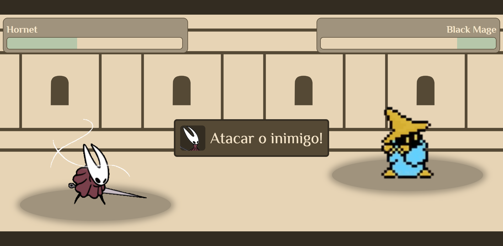

# Em Busca de Combate

Em Busca de Combate é um jogo que desafia o jogador a ser ágil para vencer nos combates contra os inimigos. Com um combate no estilo de turnos e click time event.

O jogo inclui 3 personagem para o jogador escolher e 5 fases de combates contra inimigos.

<p align="center">
  
</p>

## 📜 Como funciona o jogo

- Escolha um dos personagens para usar no jogo.
- Cada personagem tem uma habilidade diferente que dá algum benefício no jogo.
- O jogo tem 5 fases;
- Para ir para a fase de combate, aperte no ícone do inimigo.
- Para avançar entre as fases, é preciso derrotar o inimigo na fase atual.
- O combate tem uma rodada do ataque do jogador e uma rodada para defender do ataque do inimigo.
- Na rodada de atacar o inimigo o jogador deve apertar no ícone de ataque quando ele estiver claro na tela.
- Na rodada de defender o ataque inimigo o jogador deve apertar no ícone de defesa quando ele estiver claro na tela, mas não no ícone incorreto de defesa.
- O dano do ataque é calculado pelo número vez que o jogador apertou no ícone de ataque.
- O dano do ataque do inimigo é reduzido pelo cálculo do número vez que o jogador apertou no ícone de defesa, mas ao apertar no ícone incorreto de defesa ele é aumentado.
- Ao derrotar todos os inimigos das 5 fases o jogo é terminado.
- No fim do jogo é mostrada uma página contendo o dados de acertos, erros e derrotas.

## 🔨 Técnicas e tecnologias utilizadas

O projeto foi desenvolvido utilizando as seguintes tecnologias:

- `React.js` - Biblioteca para construção de interfaces dinâmicas.
- `Vite.js` - Ferramenta de construção rápida para desenvolvimento com JavaScript moderno.
- `Styled-components` - Para estilização de componentes com CSS-in-JS.
- `Context API` - Gerenciamento de estado de forma reativa.
- `React Router Dom` - Para navegação entre páginas da aplicação.

E outras dependências e ferramentas auxiliares.

Músicas e efeitos sonoros do site: https://pixabay.com

## 🛠️ Abrir e rodar o projeto

Para rodar o projeto em sua máquina local, siga estes passos:

1. Baixe o repositório do projeto para o seu computador.

2. Navegue até a pasta do projeto, extraia os arquivos e abra no seu editor de código favorito.

3. Instale as dependências executando:

   ```bash
   npm install
   ```

4. Para iniciar o servidor de desenvolvimento, utilize o comando:

   ```bash
   npm run dev
   ```

5. O projeto estará disponível em http://localhost:5173.
